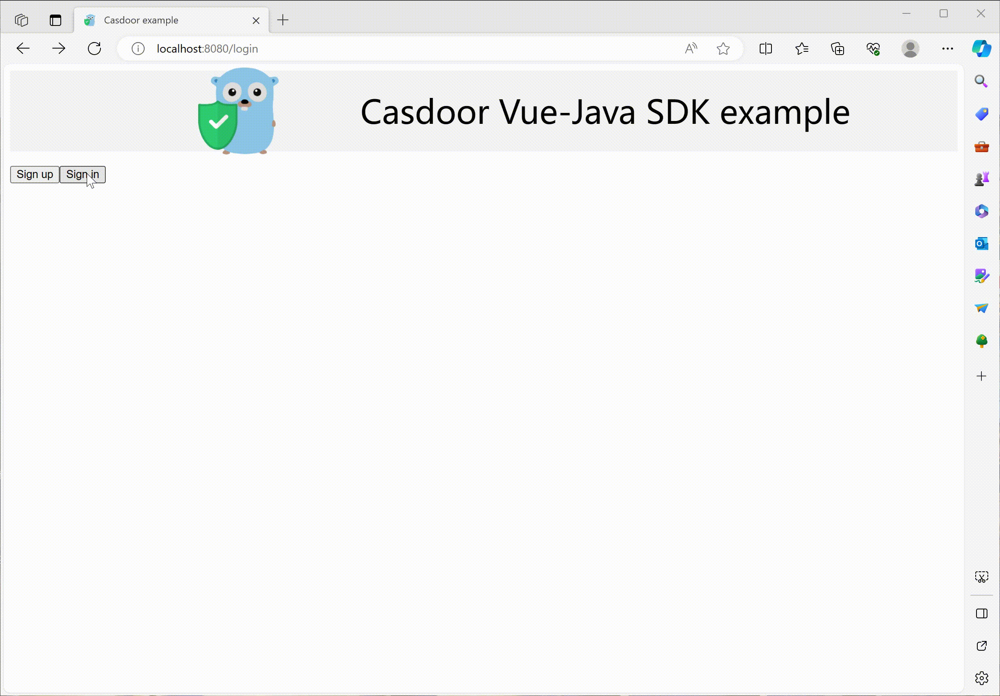

# Casdoor Java + Vue Example

[](https://github.com/casdoor/casdoor-java-vue-example/actions/workflows/build.yml)
[](https://github.com/casdoor/casdoor-java-vue-example/blob/master/LICENSE)
[](https://discord.gg/5rPsrAzK7S)

An example web app that signs users in with [Casdoor](https://casdoor.ai/), with a Vue frontend and a Java (Spring Boot) backend.

| Part     | SDK                                                               | Language             | Port |
|----------|-------------------------------------------------------------------|----------------------|------|
| Frontend | [casdoor-vue-sdk](https://github.com/casdoor/casdoor-vue-sdk)     | JavaScript + Vue 3   | 8080 |
| Backend  | [casdoor-java-sdk](https://github.com/casdoor/casdoor-java-sdk)   | Java + Spring Boot 3 | 8081 |



## How it works

1. **Sign in** sends the user to the Casdoor sign-in page (`getSigninUrl()` of casdoor-vue-sdk); the random `state` in the URL is kept in sessionStorage.
2. After signing in, Casdoor redirects back to `http://localhost:8080/callback` with `code` and `state`.
3. The callback page checks the state and sends the code to the backend (`signin()`): `POST /api/signin?code=...&state=...`.
4. The backend exchanges the code for an access token (`AuthService.getOAuthToken()`), verifies it with the certificate (`AuthService.parseJwtToken()`) and keeps the user in the session.
5. The frontend reads the signed-in user from `GET /api/get-account` and signs out with `POST /api/signout`, which also ends the Casdoor session.

| API                     | Description                                             |
|-------------------------|---------------------------------------------------------|
| `POST /api/signin`      | Exchanges the code for a token and starts the session   |
| `GET /api/get-account`  | Returns the user of the session, 401 if not signed in   |
| `POST /api/signout`     | Ends the session and the Casdoor session                |

Silent sign-in: open `http://localhost:8080/?silentSignin=1` while you are signed in to Casdoor in the same browser, and the app signs in through a hidden iframe without showing the Casdoor page.

## Prerequisites

- Java 17+ and Maven 3.9+
- Node.js 18+ and Yarn
- A Casdoor server. The example is preconfigured for the public demo server https://door.casdoor.com, so it runs as is. To use your own, see [Casdoor installation](https://casdoor.ai/docs/basic/server-installation).

## Configuration

Skip this section to try the example with the public demo server.

In your Casdoor, create (or reuse) an organization and an application, and add `http://localhost:8080/callback` to the application's **Redirect URLs**. Then fill in both parts:

### Frontend

[web/src/main.js](web/src/main.js):

```js
const config = {
  serverUrl: "https://door.casdoor.com", // Casdoor server URL
  clientId: "294b09fbc17f95daf2fe", // client ID of the application
  organizationName: "casbin", // organization of the application
  appName: "app-vue-python-example", // name of the application
  redirectPath: "/callback",
  signinPath: "/api/signin",
};
```

[web/src/config.js](web/src/config.js) holds the URL of the backend:

```js
export let serverUrl = `http://localhost:8081`
```

### Backend

[src/main/resources/application.properties](src/main/resources/application.properties):

```properties
server.port=8081

# Casdoor server URL
casdoor.endpoint=https://door.casdoor.com
# client ID and secret of the application
casdoor.client-id=294b09fbc17f95daf2fe
casdoor.client-secret=dd8982f7046ccba1bbd7851d5c1ece4e52bf039d
# the certificate of the cert used by the application: Casdoor -> Certs -> the cert -> Certificate
casdoor.certificate=-----BEGIN CERTIFICATE-----
...
-----END CERTIFICATE-----
# organization and name of the application
casdoor.organization-name=casbin
casdoor.application-name=app-vue-python-example

# the Vue frontend, allowed to call the APIs with the session cookie (CORS)
frontend-url=http://localhost:8080
```

## Run

```shell
git clone https://github.com/casdoor/casdoor-java-vue-example
cd casdoor-java-vue-example
```

Backend, at http://localhost:8081:

```shell
mvn spring-boot:run
```

Frontend, at http://localhost:8080:

```shell
cd web
yarn install
yarn serve
```

Open http://localhost:8080 and click **Sign in**. On the demo server, sign in with username `admin` and password `123`.

## Resources

- [Casdoor documentation](https://casdoor.ai/docs/overview)
- [casdoor-java-sdk](https://github.com/casdoor/casdoor-java-sdk)
- [casdoor-vue-sdk](https://github.com/casdoor/casdoor-vue-sdk)

## License

[Apache-2.0](LICENSE)
